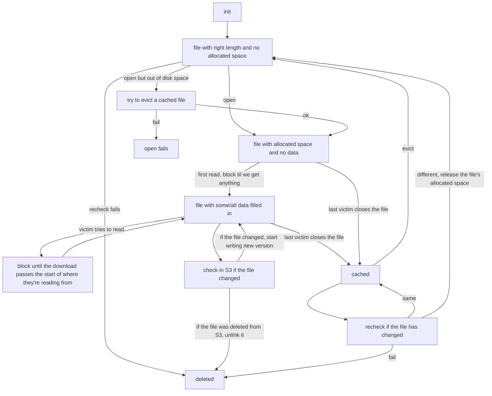

```mermaid
flowchart TB
	init --> sparse
	sparse[file with right length and no allocated space]
	sparse -->|open| allocd[file with allocated space and no data]
	sparse -->|open but out of disk space| evict[try to evict a cached file]
	evict --> |ok| allocd
	evict --> |fail| enospc[open fails]
	allocd --> |first read, block til we get anything| data[file with some/all data filled in]
	data --> |victim tries to read| block[block until the download passes the start of where they're reading from]
	block --> data
	data -->|last victim closes the file| cached
	allocd -->|last victim closes the file| cached
	cached -->|evict| sparse
	sparse -->|recheck fails| deleted
	data --> recheck[check in S3 if the file changed]
	recheck -->|if the file changed, start writing new version| data
	recheck -->|if the file was deleted from S3, unlink it| deleted
	cached --> c_recheck[recheck if the file has changed]
	c_recheck -->|same| cached
	c_recheck -->|different, release the file's allocated space| sparse
	c_recheck -->|fail| deleted
```
